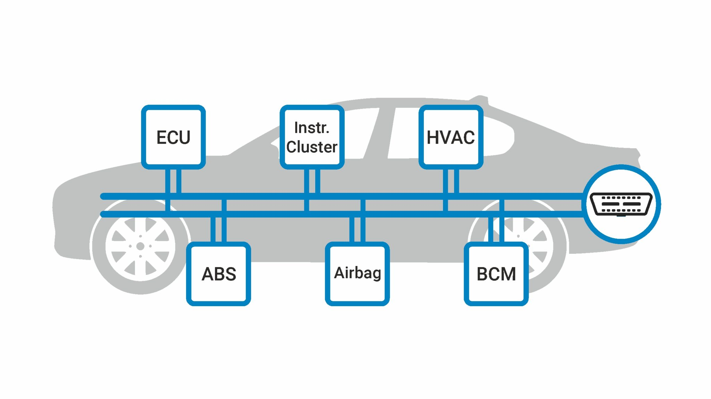
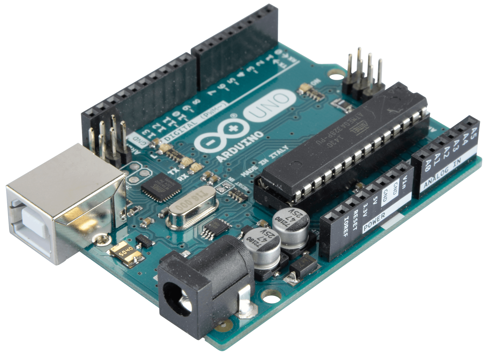
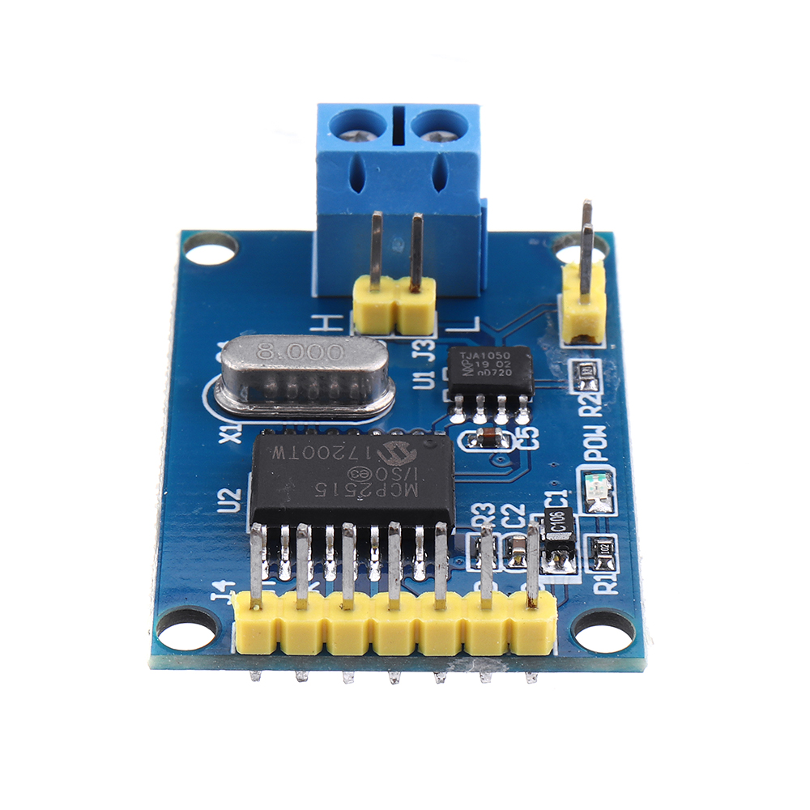
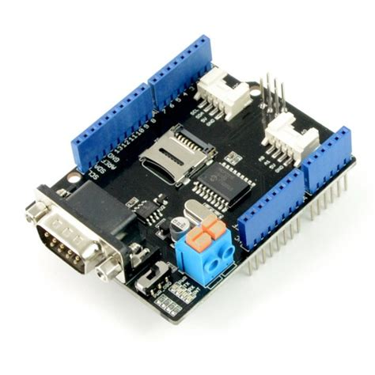

# DES02-PiRacer-instrument
## Contents Index
[1. Software Architecture](#software-architecture)  
[2. Basic knowledge of Architecture](#basics-knowledge-of-the-architecture)

## Software Architecture
/image here/
## Basic knowledge of the Architecture
### What is CAN?
A Controller Area Network (CAN bus) is a vehicle bus standard designed to allow microcontrollers and devices to communicate with each other's applications without a host computer. It is a message-based protocol, designed originally for multiplex electrical wiring within automobiles to save on copper, but it can also be used in many other contexts.

### What is Arduino?
Arduino is an open-source electronics platform based on easy-to-use hardware and software.

Arduino boards are able to read inputs - a light on a sensor, a finger on a button, or a Twitter message - and turn them into an output - activating a motor, turning on an LED, or publishing something online.

### Why Arduino, not Raspberry Pi?

- **Analog Inputs**: Arduino boards have built-in support for analog inputs, which is useful for reading data from certain types of sensors. While you can add this capability to a Raspberry Pi, it requires additional hardware.
- **Inexpensive** - Arduino boards are relatively inexpensive compared to other microcontroller platforms.
- **Cross-platform** - The Arduino Software (IDE) runs on Windows, Macintosh OSX, and Linux operating systems.
- **Simple, clear programming environment** - The Arduino Software (IDE) is easy-to-use for beginners, yet flexible enough for advanced users to take advantage of as well.
- **Open source and extensible software** - The Arduino software is published as open source tool, available for extension by experienced programmers.

### What is MCP2515? What is TJA1050?

MCP2515 is a module that receives and sends CAN signals. MCP2515 has a chip that processes CAN Connection and is integrated with TJA1050. This is connected with Arduino through SPI protocol.

The TJA1050 is a CAN transceiver responsible for properly converting signals on the CAN bus to communicate with microcontrollers and other devices.

### ****CAN BUS Shield V2.0****

CAN Bus Shield allows the microcontroller which is like Arduino to support CAN Protocol and easily communicate with other CAN devices. This is like an attachment that enhances the microcontroller.

