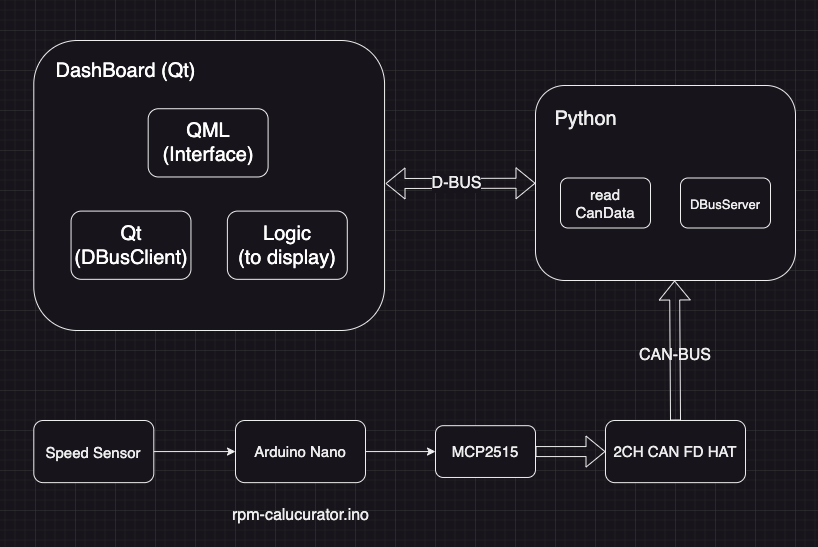

# DES02-PiRacer-instrument
## Demonstration
/* GIF demonstrating instrument cluster here*/

## Contents Index
[1. Software Architecture](#software-architecture)  
[2. Basic knowledge of Architecture](./docs/Basic-Knowledge-of-the-Architecture.md)  
[3. Hardware & System-Architecture](./docs/Systemarchitecture.md)  
[4. RPM Calculation](./docs/RPM-Calculation.md)  
[5. Battery Calculation](./docs/Battery_Level_Calculation.md)  
[6. Inter Process Communication](./docs/Inter-Process-Communication.md)  
[7. Qt & QML](./docs/Qt-QML.md)  
[8. Startup Routine](./docs/Startup-Routine.md)  
[9. Exception](./docs/Exception.md)  

## Software Architecture


## Project Structure
``` bash
.
├── app
│   ├── d-bus # D-BUS server (python)
│   ├── dashboard # application dir for dashboard
│   │   ├── asset
│   │   │   ├── fonts
│   │   │   ├── images
│   │   │   └── qml
│   │   └── log
│   └── piracer_py # dir to control piracer (gamepad, display etc.)
│       ├── piracer
│       ├── process
│          └── fonts
├── can-modules # send data to can bus from any sensor
│   └── speedsensor
├── docs # docs explains this project
│   └── imgs
└── examples # example to understand project knowledge
    ├── can
    │   ├── receiver
    │   └── transmitter
    └── rpm-calc
```
