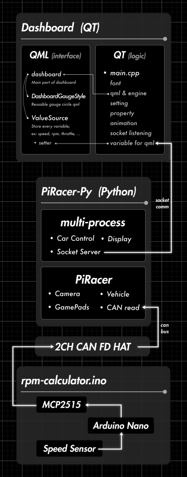
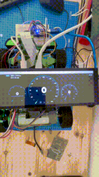

# DES02-PiRacer-instrument

## Table of contents
- [DES02-PiRacer-instrument](#des02-piracer-instrument)
  - [Table of contents](#table-of-contents)
  - [:microphone:  Introduction](#microphone--introduction)
  - [:question:  How to use](#question--how-to-use)
  - [:classical\_building:  Software Architecture](#classical_building--software-architecture)
  - [:memo:  Documentations](#memo--documentations)
  - [:runner:  Demonstration](#runner--demonstration)

## :microphone:  Introduction
This project is part of [SEA-ME Project](https://github.com/SEA-ME).
> The PiRacer instrument cluster Qt application project is aimed at creating a real-time speedometer for a PiRacer car. The application will run on a Raspberry Pi and receive speed data from a speed sensor via the in-vehicle communication using Controller Area Network (CAN) protocol. This project will provide an opportunity for students to gain practical experience in software engineering, specifically in the areas of embedded systems, software architecture, and communication protocols. The project will also allow students to gain knowledge of the GUI frameworks (eg. Qt), that are widely used in the automotive industry for developing many embedded applications. The successful completion of this project will demonstrate the students' ability to design and implement a real-world software solution, and their ability to effectively communicate their results.

You can see the full subject in this link. [SEA-ME/DES-Instrument-Cluster](https://github.com/SEA-ME/DES-Instrument-Cluster)

## :question:  How to use
- Choose what versions to use. (TCP Socket vs D-bus)
To see details about the architecture, see [Software Architecture](#classical_building--software-architecture) of README or [basic-knowledge-of-the-architecture.md](/docs/basic-knowledge-of-the-architecture.md)

## :classical_building:  Software Architecture
Application using `TCP Socket` ➝ [**`tcp-version` branch** (link)](https://github.com/Shuta-Syd/DES02-Piracer-Instrument/tree/tcp-version)
Application using `D-BUS` ➝ [**`dbus-version` branch** (link)](https://github.com/Shuta-Syd/DES02-Piracer-Instrument/tree/dbus-version)

| TCP Version | DBUS Version |
|:-------:|:-------:|
|[V1-tcp-socket.md](/docs/V1-tcp-socket.md)| |
|||

## :memo:  Documentations
You can see all documentations in [`/docs/`](/docs/) folder.
- [Automation.md](/docs/Automation.md)
- [basic-knowledge-of-the-architecture.md](/docs/basic-knowledge-of-the-architecture.md)
- [Battery-Level-Calculation.md](/docs/Battery-Level-Calculation.md)
- [CAN-Communication.md](/docs/CAN-Communication.md)
- [Design-Renewal.md](/docs/Design-Renewal.md)
- [Exception.md](/docs/Exception.md)
- [Inter-Process-Communication.md](/docs/Inter-Process-Communication.md)
- [LCD-Display.md](/docs/LCD-Display.md)
- [RPM-Calculation.md](/docs/RPM-Calculation.md)
- [Startup-Routine.md](/docs/Startup-Routine.md)
- [V1-tcp-socket.md](/docs/V1-tcp-socket.md)

## :runner:  Demonstration

