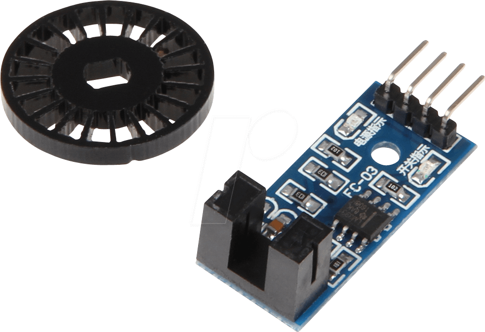
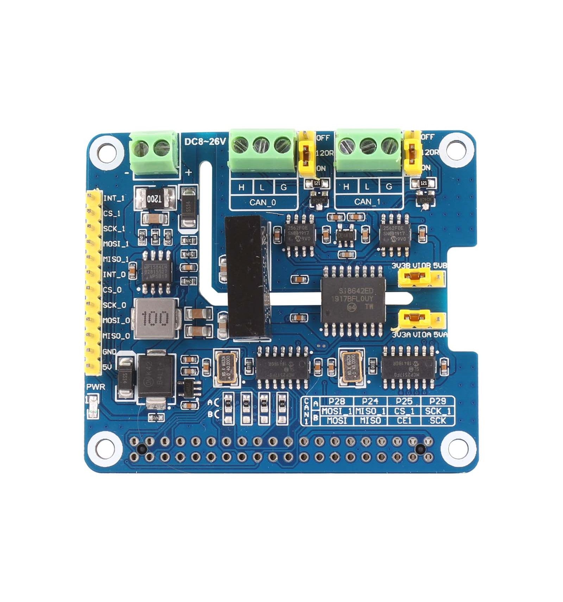

# CAN Communication
## CAN Communication with Speed Sensor (LM393)
### Materials
| PiRacer | Arduino Nano or Uno | MCP2515 | SpeedSensor | 2CH  CAN BUS FD HAT |
|:-------:|:-------------------:|:-------:|:-----------:|:------------------:|
||||||
