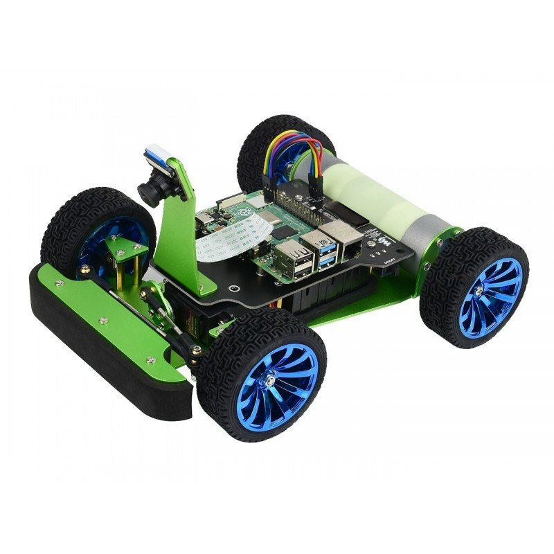
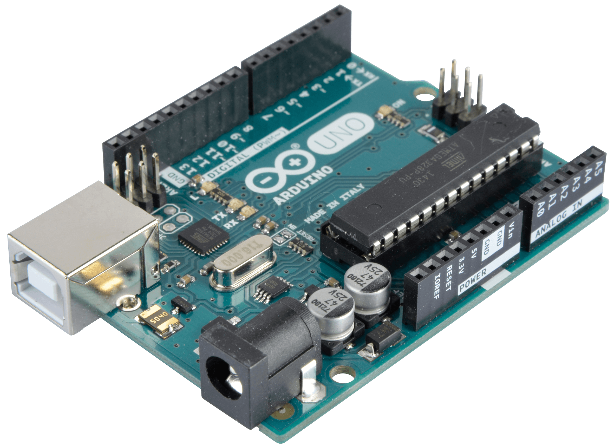

****# CAN Communication
## CAN Communication with Speed Sensor (LM393)
This section is about how to communicate with Speed Sensor (LM393) using Arduino and 2CH CAN BUS FD HAT.
### Materials
---
| PiRacer | Arduino Nano or Uno | MCP2515 | SpeedSensor | 2CH  CAN BUS FD HAT |
|:-------:|:-------------------:|:-------:|:-----------:|:------------------:|
||||||

### Wiring  Diagram
---
/image here which show line dependency/

#### Arduino nano and Sensor Sensor (LM393)
| Arduino | Speed Sensor (LM393) |
|:-------:|:--------------------:|
| 5V      | VCC                  |
| GND     | GND                  |
| D2      | OUT                  |
| A0      | A0                   |
> **Note**: A0 is Analog Input Pin Which is not mandatory to connect. 

#### Arduino nano and MCP2515
| Arduino | MCP2515 |
|:-------:|:-------:|
| 5V      | VCC     |
| GND     | GND     |
| D10     | CS      |
| D11     | SI      |
| D12     | SO      |
| D13     | SCK     |
| D2 or D3| INT     |
> **Note**: D2 or D3 is optional. If you want to use interrupt, connect D2 or D3 to INT pin of MCP2515. 

### Set up Raspberry Pi and 2CH-CAN-FD-HAT
[How to set up 2CH-CAN-FD-HAT](https://www.waveshare.com/wiki/Template:2-CH_CAN_FD_HAT_User_Manual#Working_with_Raspberry_Pi)

## Code Example
### Transmitter Code Example (Arduino Nano)
```cpp
#include <mcp2515.h>
#include <SPI.h>

#define SENSOR_PIN 2

MCP2515 mcp2515(10);
struct can_frame canMsg;
int count = 0;

void rpmCounter() {
 count++;
 Serial.println(count);
}

void setup() {
  canMsg.can_id = 0x010;
  canMsg.can_dlc = 2;
  canMsg.data[0] = 0xff;
  canMsg.data[1] = 0xff;

  Serial.begin(9600);

  mcp2515.reset();
  mcp2515.setBitrate(CAN_125KBPS);
  mcp2515.setNormalMode();

  pinMode(SENSOR_PIN, INPUT);
  attachInterrupt(digitalPinToInterrupt(SENSOR_PIN), rpmCounter, RISING);
}

void loop() {
  canMsg.data[0] = count;
  mcp2515.sendMessage(&canMsg);
  delay(1000);
}
```
Reference:
> - [MCP2515 Library](www.github.com/autowp/arduino-mcp2515)

### Receiver Code Example (Raspberry Pi)
```python
import can
import time

can_interface = 'can0'

def receive_can_messages():
    bus = can.interface.Bus(channel=can_interface, bustype='socketcan')

    while True:
        message = bus.recv()
        print(f"recieve ID={message.arbitration_id}, data={message.data}")
        time.sleep(1);

if __name__ == "__main__":
    receive_can_messages()
```
