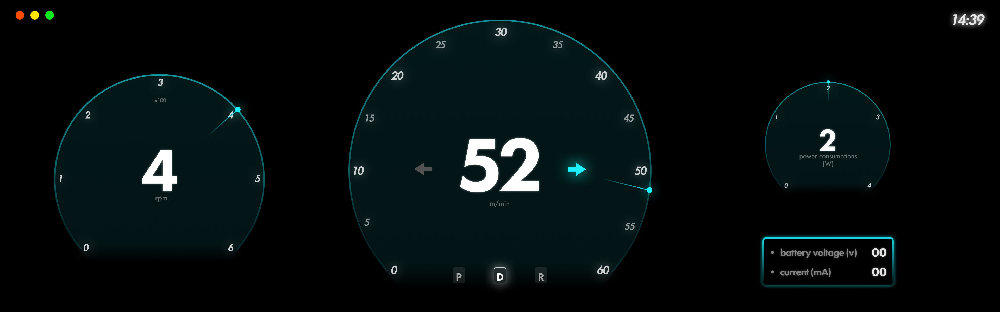

# :art: Design-Renewal
**Table of contents**
- [:art: Design-Renewal](#art-design-renewal)
  - [Before](#before)
  - [After](#after)
    - [What data is transmitted?](#what-data-is-transmitted)
    - [First, let's make the design!](#first-lets-make-the-design)

## Before

## After
### What data is transmitted?
- About direction 🔽
  - Steering
  - Throttle
  - Indicator
- About battery 🔋
  - battery voltage (V)
  - power consumption (W)
  - current (mA)
- About speed
  - speed (m/min)
  - rpm

### First, let's make the design!

[link to figma](https://www.figma.com/file/AbLx0dzamewmdk4J5WxrAq/DES02-PiRacer-Instrument-Dashboard?type=design&node-id=0%3A1&mode=design&t=hcxtPzIukX6i8xZH-1)

