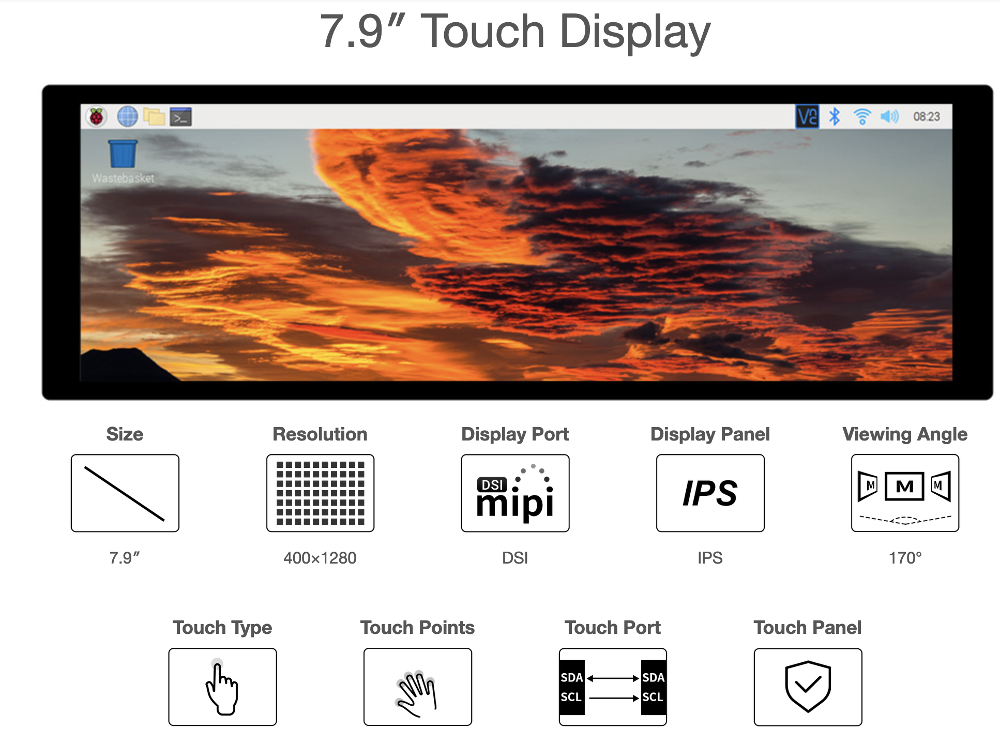
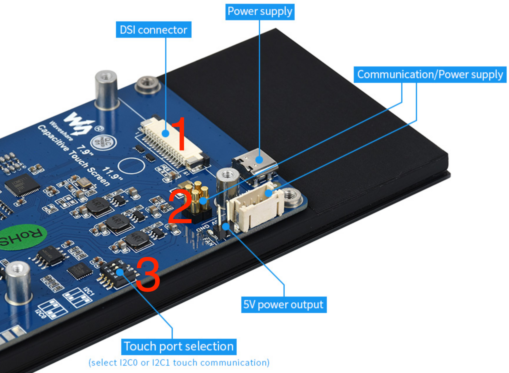
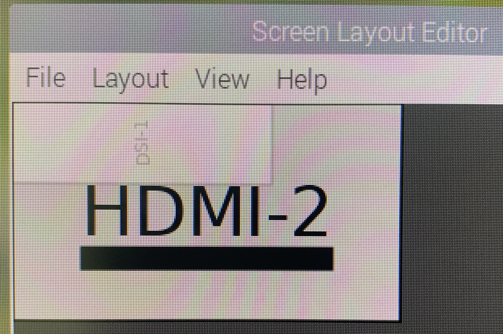

# LCD Display

In this section we will describe the hardware and software settings of the LCD Display.

## Hardware
Modell: Waveshare 7.9inch DSI LCD 400×1280 



(see: [1])

### Mount on Raspberry Pi
The LCD Display is connected on the Raspberry Pi using the DSI connector (1). 
The Power (5V) is supplied via the GPIO pins (2). i2c is used to get the touchscreen input. The port selection can be adjusted with the the I2C DIP switches (3).



(see: [2])

## Software Settings
### Install Driver
Step 1: Download and enter the Waveshare-DSI-LCD driver folder
```bash
git clone https://github.com/waveshare/Waveshare-DSI-LCD
cd Waveshare-DSI-LCD
```

Step 2: View the kernel version and cd to the corresponding file directory
Enter 
```bash
uname -a 
cd 6.1.21
```
In the Driver version we used 6.1.21 was the latest supported kernel version. However, our kernel version was 6.1.54-v8+  and therefore we had to downgrade the kernel. See the section below for instructions on how to downgrade the kernel.

Step 3: Check the architecture of your OS system using the uname -a command again. Then, enter the 64 directory for 64-bit systems, enter the 32 directory for 32-bit systems.
```bash
uname -a 
cd 64
```

Step 4: Enter your corresponding model command to install the driver, pay attention to the selection of the I2C DIP switch. The supported models are listed in the respositories readme.txt. 
For the 7.9inch DSI LCD 400×1280, run the follwoing command: 
```bash
sudo bash ./WS_xinchDSI_MAIN.sh 79 I2C0
```
Step 5: Wait for a few seconds, when the driver installation is complete and no error is prompted, restart and load the DSI driver and it can be used normally. 
```bash
sudo reboot
```
Step 6: Open the "config.txt" file in the root directory
```bash
sudo nano /boot/config.txt
```
Add the following line to the end of the file.
```bash
dtoverlay=WS_xinchDSI_Screen,SCREEN_type=5,I2C_bus=10
dtoverlay=WS_xinchDSI_Touch,invertedx,invertedy,I2C_bus=10
```
(see: [2])

### Downgrad Kernel

If needed, the Kernel of Rasbian can be downgraded using the following steps: 

Step1: Get the git-Hash of the corresponding Kernel version commit from https://github.com/raspberrypi/rpi-firmware. 
Scroll to the needed version - „kernel: bump to x.x.xx“. Click on "Copy the full SHA" to copy the git-hash to your clipboard. 
To start the installation of the needed version (here it is 6.1.21), open the console and enter the following command: 
``` bash
sudo rpi-update 1440b3e0b52075a9ec244216cddcf56099c28dfa
```
This will set the kernel module and the according firmeware files. 

Step : If the installtion is done, Reboot. 
```bash
sudo reboot
```
(see: [3])

## Screen Configuration
### Rotation
The screen is set horizontally by default. If you need to set the screen vertically, you can do thr following. After you are done, save the changes and restart. 
``` bash
click "start menu" ➡️ Preferences ➡️ Screen Configuration ➡️ Configure ➡️ Screens ➡️ DSI-1 ➡️ Orientation
```

### Screen Layout 
We choose the following setting: 
- Primary Screen: HDMI Screen
- Secondary Screen: DSI Screen



## References
[[1]](https://www.waveshare.com/7.9inch-dsi-lcd.htm)
[[2]](https://www.waveshare.com/wiki/7.9inch_DSI_LCD)
[[3]](https://github.com/raspberrypi/rpi-firmware)


