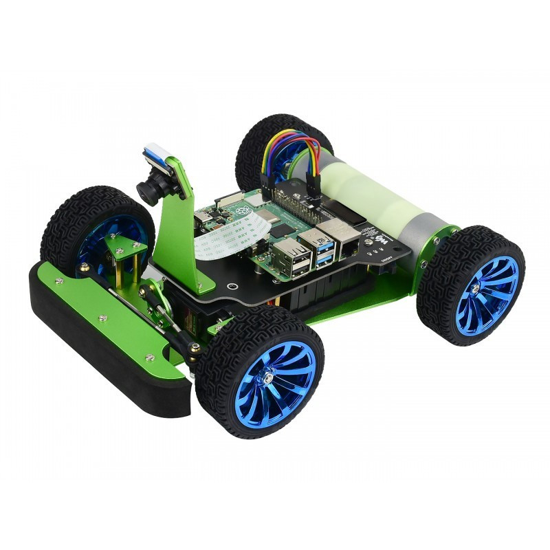
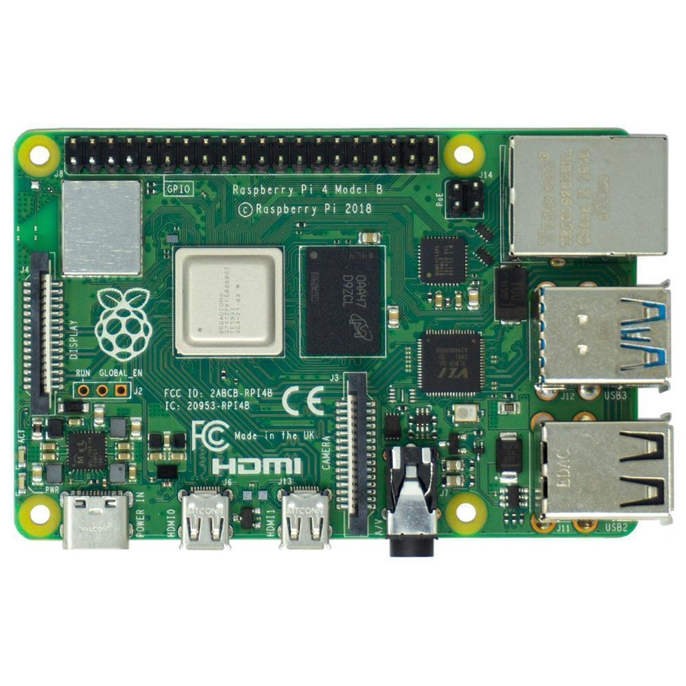
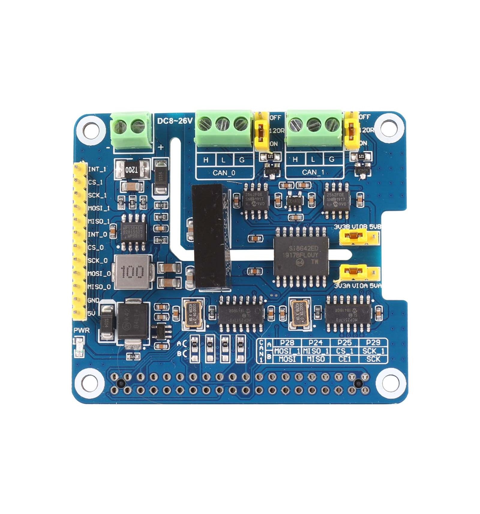
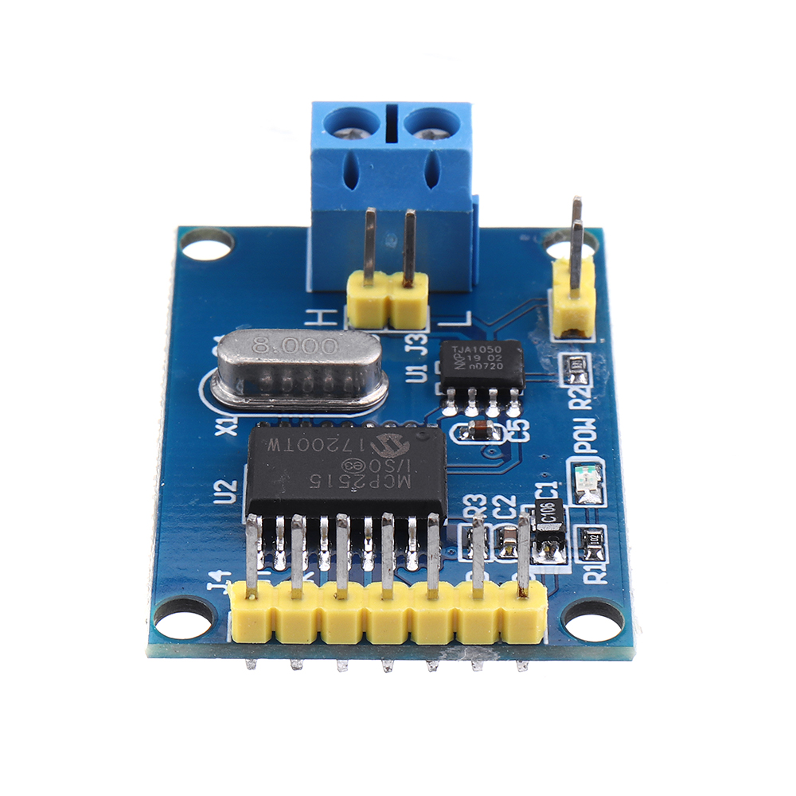
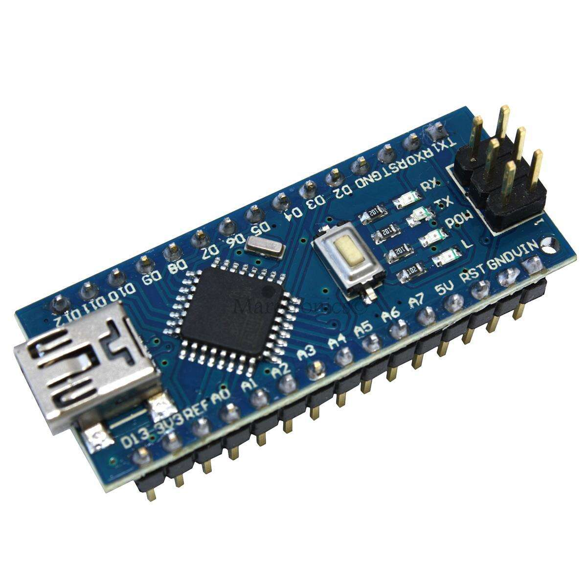
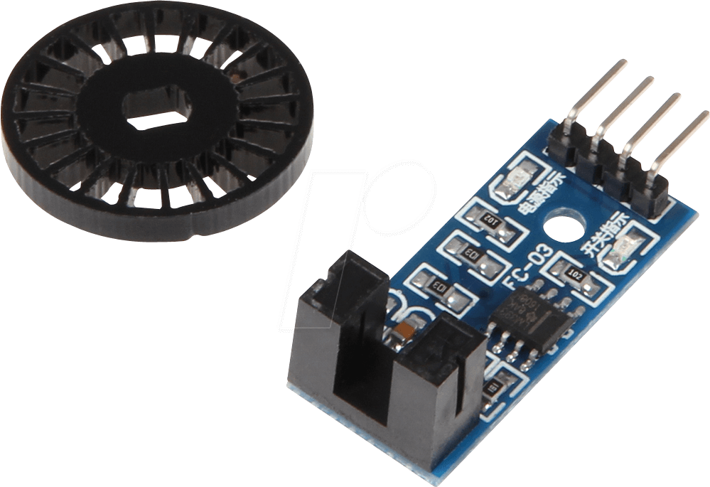
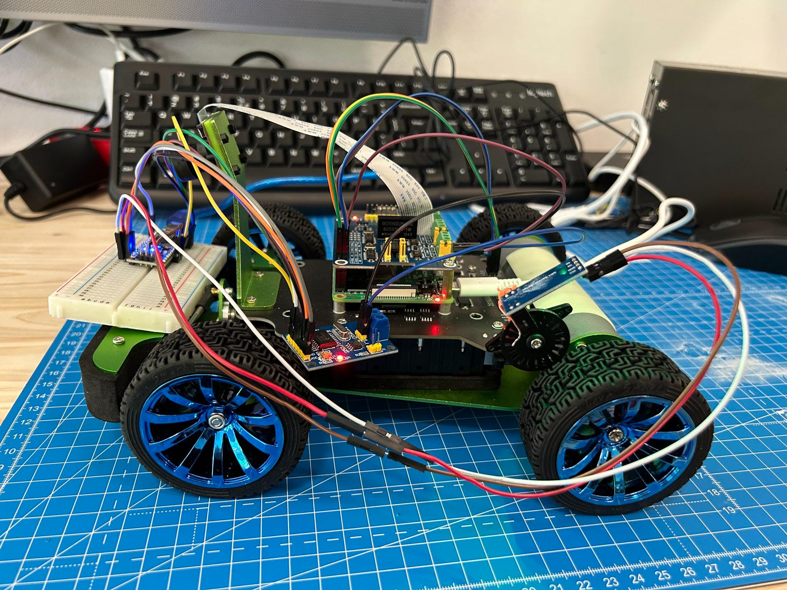
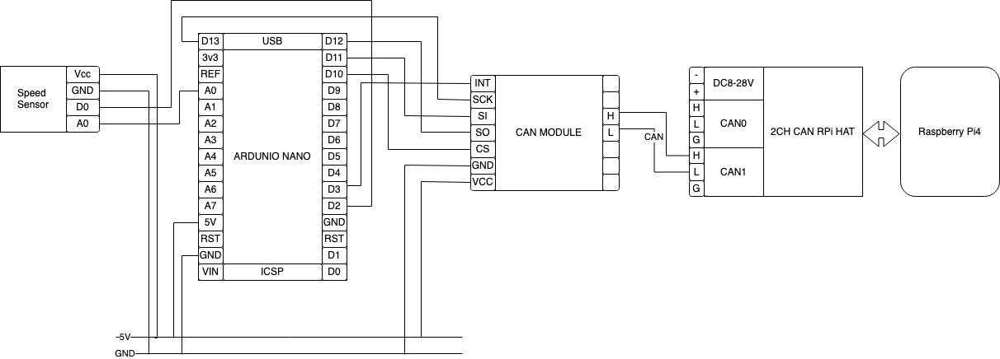

# Hardware & System-Architecture
This section describes the hardware and system architecture of the PiRacer instrument cluster. 
## Materials
---
The following materials are used for this section. The Speed Sensor (LM393) is connected with Arduino Nano/Uno and the Arduino Nano/Uno is connected with MCP2515. The CAN BUS is stablished between the MCP2515 and the 2CH CAN BUS FD HAT. 
The 2CH CAN BUS FD HAT is connected with Raspberry Pi 4. 
The drivetrain of the PiRacer is connected via I2C with the Raspberry Pi 4.

| PiRacer | Raspberry Pi 4 | 2CH CAN-BUS FD HAT | MCP2515 | Arduino Nano | SpeedSensor |
|:-------:|:-------:|:-------------------:|:-------:|:-----------:|:------------------:|
|||||||

This is how the assembled PiRacer looks like:



## Wiring
---
The following picture shows the wiring of the PiRacer instrument cluster.



 Sensor Sensor (LM393) -> Arduino Nano
| LM393 | Arduino | 
|:--------------------:|:-------:|
| VCC                  |5V      | 
| GND                  |GND     | 
| OUT                  | D2     | 
| A0                   | A0     | 
> **Note**: A0 is Analog Input Pin Which is not mandatory to connect. 

 Arduino Nano -> MCP2515
| Arduino | MCP2515 |
|:-------:|:-------:|
| 5V      | VCC     |
| GND     | GND     |
| D10     | CS      |
| D11     | SI      |
| D12     | SO      |
| D13     | SCK     |
| D2 or D3| INT     |
> **Note**: D2 or D3 is optional. If you want to use interrupt, connect D2 or D3 to INT pin of MCP2515. 

## Set Up 
---
Raspberry Pi and 2CH-CAN-FD-HAT
### OS: Ubuntu 22.04 LTS
[How to set up 2CH-CAN-FD-HAT](https://www.waveshare.com/wiki/Template:2-CH_CAN_FD_HAT_User_Manual#Working_with_Raspberry_Pi)
> **Note** Sometimes can0 and can01 is swapped, So Please note that. If they are swapped, you have to rename can0 can1.

## Code Example for testing
---
### Transmitter Code Example (Arduino Nano)
> **Note**: We used to try to use MCP2515 Library, but it didn't work. So we used MCP_CAN Library instead of MCP2515 Library.
> Maybe it might work depending on the external environment such as OS, Arduino version, etc. so please try it to use MCP2515 Library.

```c++
#include <mcp_can.h>
#include <SPI.h>

#define SENSOR_PIN 2

MCP_CAN CAN(10);
uint8_t count = 0;

void rpmCounter() {
 count++;
 Serial.println(count);
}

void setup() {

  Serial.begin(9600);

  CAN.begin(MCP_ANY, CAN_125KBPS, MCP_8MHZ);
  CAN.setMode(MCP_NORMAL);

  pinMode(SENSOR_PIN, INPUT);
  attachInterrupt(digitalPinToInterrupt(SENSOR_PIN), rpmCounter, RISING);
}

void loop() {

  uint8_t data[8];
  int can_id = 0x125; // optional can id
  int can_dlc = 8; // data length you want to send
  memcpy(data, &count, 8); // copy count to data array

  int status = CAN.sendMsgBuf(can_id, 0, can_dlc, data);

  if (status == CAN_OK)
    Serial.println("Success");
  else 
    Serial.println("Error");
  delay(1000);
}
```
Reference:
> 1. [MCP_CAN Library](https://github.com/coryjfowler/MCP_CAN_lib/)
> 2. [MCP2515 Library](www.github.com/autowp/arduino-mcp2515)

### Receiver Code Example (Raspberry Pi)
```python
import can
import time

can_interface = 'can0'

def receive_can_messages():
    bus = can.interface.Bus(channel=can_interface, bustype='socketcan')

    while True:
        message = bus.recv()
        print(f"recieve ID={message.arbitration_id}, data={message.data}")
        time.sleep(1);

if __name__ == "__main__":
    receive_can_messages()
```
Reference:
> 1. [ python-can Library](https://pypi.org/project/python-can/)
